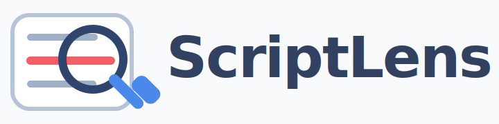

# 

ScriptLens is an open-source Chrome extension for desktop YouTube watch pages.

It analyzes YouTube video transcripts, titles, and descriptions for AI-like writing patterns with an inline-first workflow, local-first scoring, and an optional localhost helper for harder transcript recovery cases.

## Repository layout

- `ai-script-detector/` - the Chrome extension source, docs, tests, packaging scripts, and store assets
- `.github/workflows/pages.yml` - GitHub Pages deployment for the public docs in `ai-script-detector/docs`

## Quick start

```bash
cd ai-script-detector
npm install
```

Then:

1. Open `chrome://extensions`
2. Enable Developer mode
3. Click Load unpacked
4. Select `ai-script-detector`

## Project links

- Extension README: [ai-script-detector/README.md](ai-script-detector/README.md)
- Privacy policy source: [ai-script-detector/docs/privacy.html](ai-script-detector/docs/privacy.html)
- Support page source: [ai-script-detector/docs/support.html](ai-script-detector/docs/support.html)

## Open source

This project is published as an open-source Chrome extension under the MIT License.
